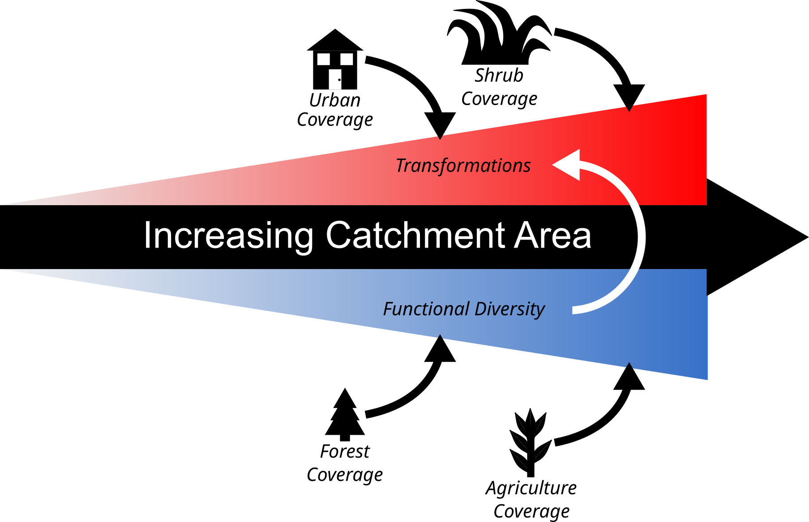

# Functional diversity of riverine DOM is related to catchment size
Within this repository, we have the scripts and processed versions of the data necessary to replicate the analyses performed within the manuscript titled "Riverine organic matter functional diversity increases with catchment size". Below, you will find a brief description of each of the files:
- <b>RC2_Analysis_Final.R</b> is the key script for generating the results presented in the manuscript including calculating Rao's functional diversity. Notable exclusions in this script include: the transformation analysis and the metabolite/DOM dendrogram creation script which can both be found <a href="https://github.com/danczakre/Meta-Metabolome_Ecology">here</a>. General usage is to point to the directory for the files found in the Data for Manuscript.zip and modify the dist.to.cram() function to point to the Hertkorn_CRAM_DB.csv described below.
- <b>bMNTD_Fast.R</b> is a modified version of the comdistnt script that relies on the capabilities of the Rfast package. It runs substantially faster than comdistnt but is not multithreaded (functions from the <a href="https://cran.r-project.org/web/packages/iCAMP/index.html">iCAMP R package</a> are a good alternative for parallelization).
- <b>Data for Manuscript.zip</b> contains all of the specific files needed to replicate the results presented in the manuscript.
- <b>Hertkorn Files.zip</b> contains all of the files necessary to run the CRAM similarity score function contained with the RC2_Analysis_Final.R. These files include: a table of CRAM molecular formulas obtained from <a href="https://doi.org/10.1016/j.gca.2006.03.021">Hertkorn et al., 2006</a>, a script to convert the table into our desired format (Hertkorn_CRAM_DB.R), and the output for that script (Hertkorn_CRAM_DB.csv).
